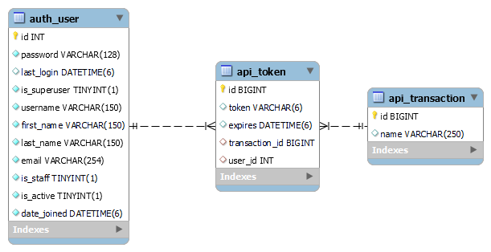

# Backend Token Virtual
Este pequeño proyecto tiene el objetivo de mostrar una implementación de la funcionalidad de "Token Virtual" o "Token Digital" usado por lo general para la realización de transacciones en diferentes bancos a nivel nacional.

Otras funcionalidades como la autenticación de usuarios o manejo de sesiones no se implementan en este proyecto.

Tambien existe el proyecto del token virtual por lado del cliente en el que se usan los endpoints mencionados más adelante. Para más información use el siguiente [link](https://github.com/avillao/Frontend-Token-Virtual).

## Indice
* [Dependencias](#dependencias)
* [Como correr el servidor](#como-correr-el-servidor)
* [Diagrama de la base de datos](#diagrama-de-la-base-de-datos)
* [Endpoints](#endpoints)
* [Lógica detrás de la implementación del token](#lógica-detrás-de-la-implementación-del-token)

## Dependencias
* Python 3.10.8
* Django 4.1.7
* MySQL 8.0
* Django Rest Framework 3.14.0

Otras dependencias se encuentran en el archivo [requirements.txt](./requirements.txt).

## Antes de empezar
El servidor tiene implementados modelos y datos a ser insertados en la base de datos. Puede usar el siguiente comando:
`python manage.py migrate`

Para más información visite el siguiente [link](https://docs.djangoproject.com/en/4.1/topics/migrations/#workflow).

Para correr el servidor es necesario el siguiente comando:
`$ python manage.py runserver`

Nota: Los archivos correspondientes a las migraciones ya están creados, e insertan inicialmente 3 usuarios y 3 transacciones.

## Diagrama de la base de datos

Por defecto Django nos crea varias tablas para distintos propositos, en esta ocasión solo usamos la tabla `auth_user`.

Las tablas `api_token` y `api_transaction` fueron creadas a partir de modelos propios. 

La tabla `api_token` guarda información referente al token de 6 dígitos, el usuario, el tiempo de expiración y la transacción en la que se usó el token.

La tabla `transaction` solo contiene el identificador y el id de la transacción.

## Endpoints

| Metodo | Endpoint | Query Params|
| ------ | -------- | ---------- |
| GET | api/generarToken/ | <strong>user:</strong> email del usuario  |
| POST | api/usarToken/ | <strong>user:</strong> email del usuario <strong>token:</strong> token de 6 dígitos <strong>transaction:</strong> id de la transacción|

Ejemplo:
* `http://127.0.0.1:8000/api/generarToken/?user=user1@example.com`
* `http://127.0.0.1:8000/api/usarToken/?user=user1@example.com&token=23821a&transaction=3`

## Lógica detrás de la implementación del token
Con el endpoint "generarToken" se obtiene un token de la base de datos o se genera uno nuevo. Mientras el campo "id_transaction" sea nulo se devolverá o reemplazará dicha fila en la base de datos con un nuevo token. Si el último token ya cuenta con un id de transacción (es decir que se ha usado), la llamada del api creará una fila en la base de datos con un nuevo token con una expiración de 60 segundos despues de haberlo creado. De esta manera se guarda un historial de los token generados con sus respectivos usos en las transacciones.

El endpoint "usarToken" valida que el token sea el correcto y actualiza el id de la transacción en la base de datos con los datos dados por el usuario.

